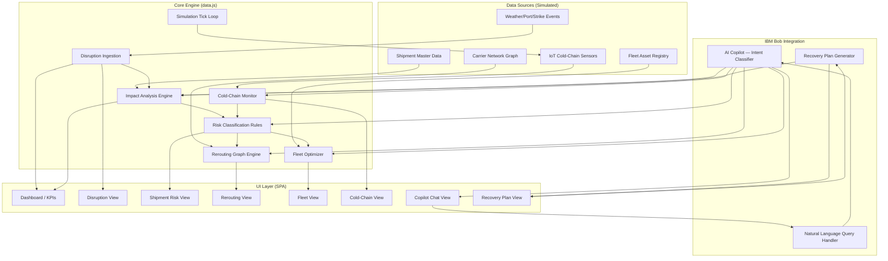

# Architecture — SupplyGuard AI

## System Diagram



---

## Component Table

| Component | File | Responsibility |
|-----------|------|----------------|
| Data Engine | `src/data.js` | All simulated data: shipments, disruptions, fleet, carriers, sensor streams |
| Simulation Loop | `src/data.js` | `setInterval`-based tick that updates sensor readings, shipment statuses, disruption progression |
| App Router | `src/app.js` | Single-page navigation, view switching, top bar, alert panel |
| Dashboard View | `src/views/dashboard.js` | KPI cards, trend charts, mini disruption map |
| Disruptions View | `src/views/disruptions.js` | Active disruption table, severity badges, impact radius |
| Shipments View | `src/views/shipments.js` | Risk-classified shipment list, filter/sort, detail modal |
| Rerouting View | `src/views/rerouting.js` | Route comparison cards, cost/delay trade-off charts |
| Fleet View | `src/views/fleet.js` | Asset grid, idle/active status, redeployment recommendations |
| Cold-Chain View | `src/views/coldchain.js` | Live Chart.js sensor feeds, excursion alerts, regulatory badges |
| Copilot View | `src/views/copilot.js` | Chat interface, intent classifier, response renderer |
| Recovery View | `src/views/recovery.js` | Executive plan builder, timeline, action matrix |
| Styles | `src/style.css` | Dark-theme design system, component library |

---

## Data Flow — End to End

```
1. Page Load
   └─ data.js initialises: 200 shipments, 3 disruptions, 48 fleet assets,
      18 cold-chain streams, 12 carriers, route graph

2. Simulation Tick (every 2s)
   └─ Cold-chain sensors update → excursion detection runs
   └─ Shipment statuses evolve → risk re-classification fires
   └─ Disruption severity may escalate or resolve
   └─ UI components holding live references auto-refresh

3. User navigates to a view
   └─ View render function reads from shared APP_STATE
   └─ Charts are mounted / updated in-place
   └─ Event listeners attached for user actions

4. User asks Copilot a question
   └─ Input tokenised → intent matched against 20+ patterns
   └─ Intent handler reads current APP_STATE
   └─ Structured answer rendered with live numbers

5. User clicks "Generate Recovery Plan"
   └─ Recovery engine aggregates: disruptions + affected shipments +
      fleet recommendations + cold-chain alerts
   └─ Renders printable executive document with timestamp
```

---

## Security & Scalability Notes

**For this hackathon demo:**
- No authentication (demo mode — all data is simulated)
- No server-side component — fully client-side SPA
- No real credentials or PII in any file

**For production:**
- IBM App ID for role-based access (Ops Manager / Compliance / Executive)
- Backend API layer (Node.js / Python FastAPI) connecting to real TMS/ERP via REST
- WebSocket server for true real-time IoT ingestion
- PostgreSQL for shipment master data, TimescaleDB for sensor time-series
- IBM watsonx.ai for production-grade Copilot NLP
- Kubernetes deployment on IBM Cloud with autoscaling
